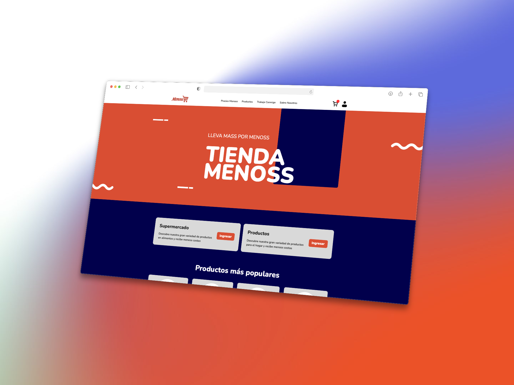

# MENOSS Landing Page 🚀

Proyecto de desarrollo web realizado en la **Universidad Tecnológica del Perú
(UTP)** - 2025.

Este repositorio contiene la **landing page del proyecto MENOSS**, desarrollada
con tecnologías web puras como parte del curso de Desarrollo Web. El sitio está
diseñado para ser una presentación visual clara, atractiva y modular del
proyecto MENOSS.

## 🌐 Descripción

**MENOSS** es una propuesta académica enfocada en soluciones digitales
sostenibles, inspirada en la ya existente
[MASS](https://www.tiendasmass.com.pe). Esta landing page sirve como plataforma
de presentación para sus servicios e identidad visual.

## 🛠️ Tecnologías Utilizadas

- HTML5
- CSS3 (con modularización por página)
- Responsive Design (diseño adaptable a dispositivos móviles)

> ⚠️ Este proyecto **no utiliza frameworks** como React, Astro ni librerías
> externas. Todo el desarrollo se ha hecho de forma artesanal, aplicando buenas
> prácticas y estructuras organizadas en HTML y CSS.

## 📁 Estructura del Proyecto

```bash
menoss-landing/
├── public/                 # Archivos estáticos (imágenes, íconos, etc.)
├── src/
│   ├── pages/              # Cada carpeta representa una página
│   │   ├── login/
│   │   │   └── index.html
│   │   ├── productos/
│   │   │   ├── bebidas/
│   │   │   │   └── index.html
│   │   │   ├── congelados/
│   │   │   │   └── index.html
│   │   │   └── index.html
│   │   ├──  register/
│   │   │   └── index.html
│   │   ├── 404.html
│   │   └── index.html
│   └── styles/
│       ├── index.css
│       ├── login.module.css
│       ├── 404.module.css
│       └── other.module.css...
```

## ▶️ Cómo visualizar el proyecto

Puedes abrir directamente cualquier archivo index.html desde tu navegador. Por
ejemplo:

```bash
src/pages/index.html
```

No se requiere entorno de desarrollo ni servidores locales, ya que el sitio
funciona completamente en el navegador.

## 🎯 Objetivos Académicos

- Aplicar estructuras semánticas con HTML5.
- Modularizar estilos con CSS por página.
- Diseñar una landing page responsive desde cero.
- Organizar un proyecto web de forma clara y escalable.
- Desarrollar sin frameworks externos para fortalecer el entendimiento de
  tecnologías base.

## 📸 Vista previa



📘 Este proyecto fue realizado con fines académicos y refleja buenas prácticas
de desarrollo web utilizando HTML y CSS puro.
